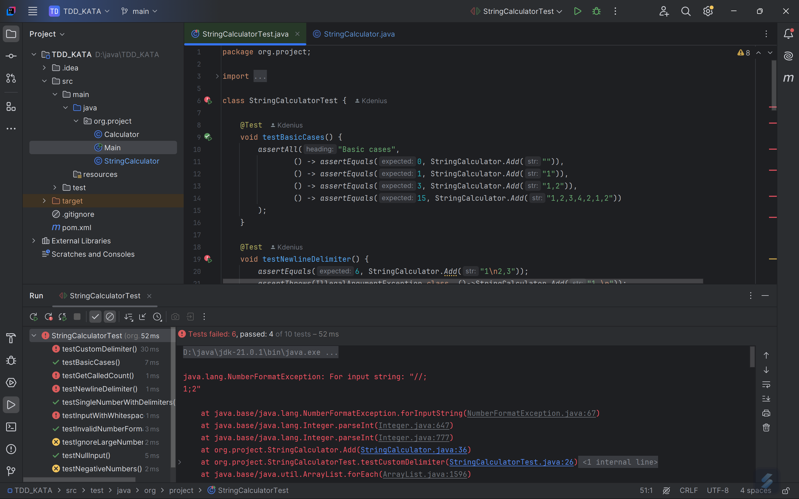
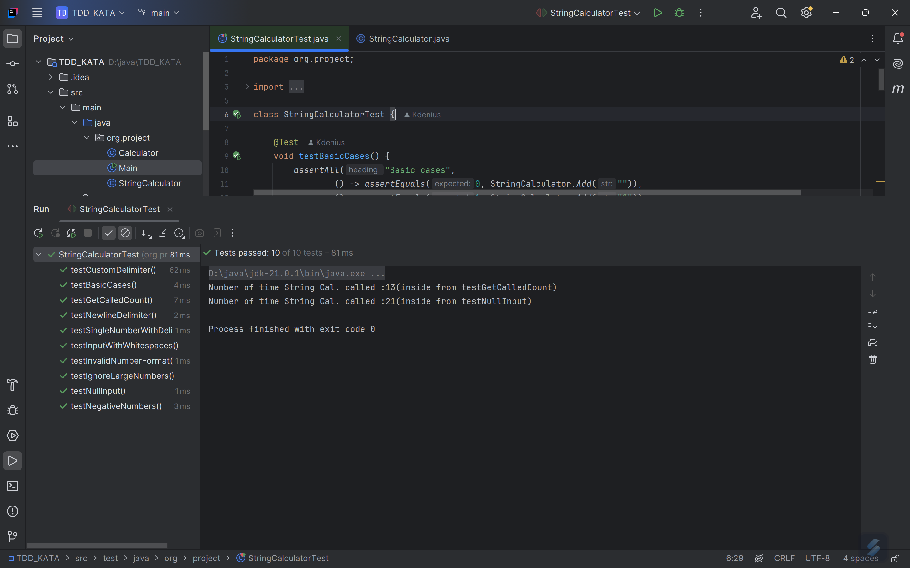
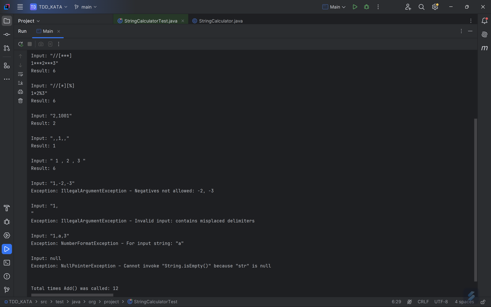

# 🧪 String Calculator – TDD in Java with JUnit

This project demonstrates the principles of **Test-Driven Development (TDD)** by building a `StringCalculator` class in Java. Each feature is introduced incrementally through failing tests, followed by minimal implementation and refactoring — the classic Red → Green → Refactor cycle.

---

## 🚀 Getting Started in IntelliJ

1. **Clone the Repository**
   ```bash
   git clone https://github.com/Kdenius/StringCalculator_TDD.git
   
   cd StringCalculator_TDD
2. **Launch IntelliJ IDEA**
    - Click on `File` → `Open...`
    - Navigate to the cloned project folder and select it
3. **Run the Tests**
    - Open the file: `StringCalculatorTest.java`
    - Right-click anywhere inside the file
    - Select `Run 'StringCalculatorTest'` from the context menu

This will execute all the unit tests defined in the `StringCalculatorTest` class.
## ✅ Test Cases Summary

The `StringCalculator` is tested against various input formats and edge cases to ensure correctness and robustness. Here's a breakdown of the test scenarios:

### 1. Basic Cases
- Input: `""` → Output: `0`
- Input: `"1"` → Output: `1`
- Input: `"1,2,3,4,2,1,2"` → Output: `15`

### 2.  Newline as Delimiter
- Input: `"1\n2,3"` → Output: `6`
- Input: `"1,\n"` → Throws: `IllegalArgumentException`

### 3.  Custom Delimiters
- Input: `"//;\n1;2"` → Output: `3`
- Input: `"//[***]\n1***2***3"` → Output: `6`
- Input: `"//[**][%%]\n1**2%%3"` → Output: `6`
- Input: `"//[*][%]\n1*\n2%3"` → Throws: `IllegalArgumentException`

### 4.  Negative Numbers
- Input: `"1,-2,-3"` → Throws: `IllegalArgumentException` with message: `"Negatives not allowed: -2, -3"`

### 5.  Call Count
- Tracks how many times `Add()` is called using `GetCalledCount()`

### 6.  Ignore Large Numbers
- Input: `"2,1001"` → Output: `2` (ignores numbers > 1000)
- Input: `"2,1000"` → Output: `1002` (1000 is included)

### 7.  Input with Whitespaces
- Input: `" 1 , 2 , 3 "` → Output: `6`

### 8.  Invalid Number Format
- Input: `"1,a,3"` → Throws: `NumberFormatException`

### 9.  Single Number Surrounded by Delimiters
- Input: `",,1,,"` → Output: `1`

### 10. Null Input
- Input: `null` → Throws: `NullPointerException`

## 🔄 Switching Between Add() Versions

Each version of the `Add()` method is documented in `StringCalculator.java`:

1. Open `StringCalculator.java`
2. Find the version block (e.g. `// Version 4.0 – Negative Number Validation`)
3. Uncomment the version you want to test, and comment out the others
4. Run `StringCalculatorTest.java` to check which tests pass/fail

This helps trace the code evolution through TDD stages.

## 🖼️ Screenshots


### Version 1 Output


### Version 7 Output


### Main Class Output
